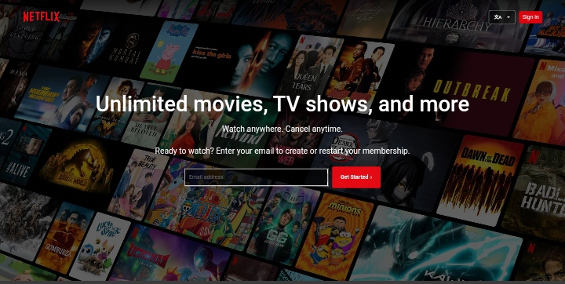
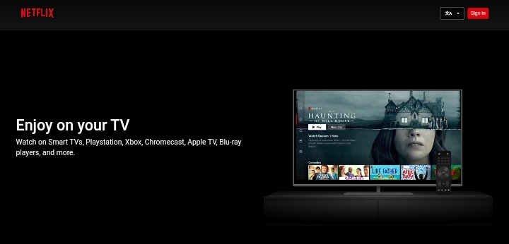
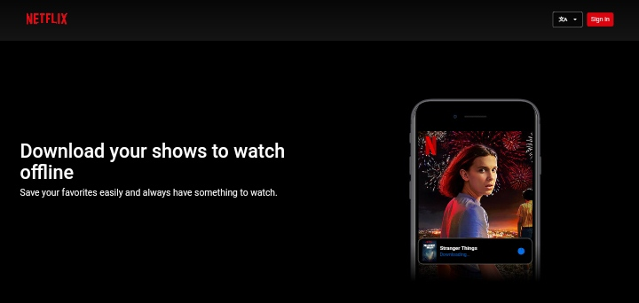
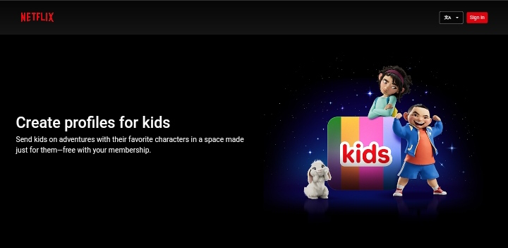
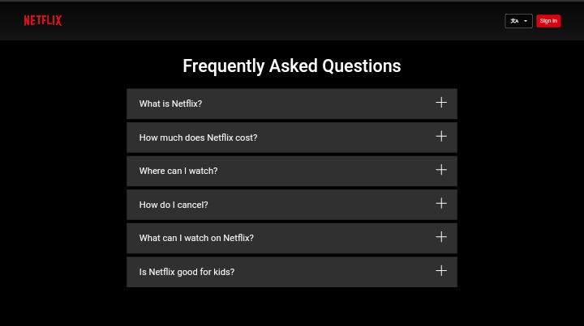
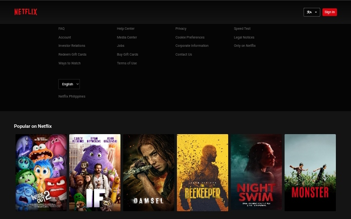

# Netflix Philippines Clone

This project is a clone of the Netflix Philippines website, showcasing a user interface for browsing and streaming movies and TV shows.

## Table of Contents

- [Disclaimer](#disclaimer)
- [Features](#features)
- [Screenshots](#screenshots)
- [Setup](#setup)
- [Usage](#usage)
- [Contributing](#contributing)
- [License](#license)

## Disclaimer

This project is for educational purposes only. It is not affiliated with, endorsed by, or connected to Netflix in any way. All trademarks, service marks, and company names are the property of their respective owners.

## Features

- Responsive design compatible with various devices.
- Sections include:
  - Hero section with email sign-up form.
  - TV section showcasing streaming capabilities.
  - Download section for offline viewing.
  - Kids section highlighting profiles for children.
  - FAQ section addressing common questions.
  - Popular content slider.
- Language selector for English and Filipino.
- Interactive FAQ with expandable answers.
- Footer with multiple navigation links.

## Screenshots







## Setup

1. Clone the repository:
    ```sh
    git clone https://github.com/JohnDev19/netflix-philippines-clone.git
    ```
2. Navigate to the project directory:
    ```sh
    cd netflix-philippines-clone
    ```
3. Open `index.html` in your preferred web browser.

## Usage

To view the website, open the `index.html` file in any modern web browser. Explore the various sections, interact with the FAQ, and try out the language selector.

## Contributing

Contributions are welcome! Please follow these steps:

1. Fork the repository.
2. Create a new branch:
    ```sh
    git checkout -b feature/your-feature-name
    ```
3. Make your changes and commit them:
    ```sh
    git commit -m "Add your message"
    ```
4. Push to the branch:
    ```sh
    git push origin feature/your-feature-name
    ```
5. Open a pull request.

## License

This project is licensed under the MIT License. See the [LICENSE](LICENSE) file for details.
